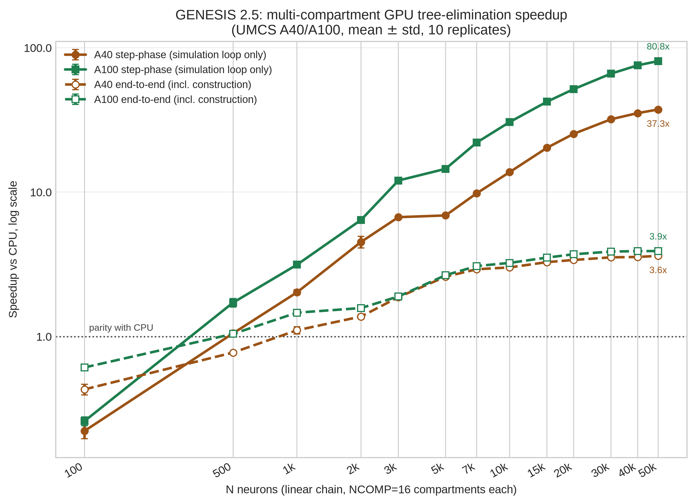

# GENESIS 2.5

GENESIS 2.5 is GENESIS 2.4 / PGENESIS 2.4 with two new, optional accelerator
backends for the `hsolve` compartmental solver: OpenCL and CUDA, on the same
interface. Nothing about the existing CPU, MPI, model files, or SLI scripts
changes. If you don't turn a GPU backend on, GENESIS behaves exactly as it
did in 2.4.

Along the way we also found and fixed some pre-existing bugs that have
nothing to do with GPUs: three Hines-solver defects that silently dropped
`inject`-driven voltage transients in multi-neuron `hsolve` setups, and five
`O(n²)` linear-scan patterns in element creation and `hsolve` setup that made
building large models effectively quadratic in time. Both fixes benefit any
GENESIS/PGENESIS user, accelerated or not.

A manuscript describing all of this is being prepared for submission to
[SoftwareX](https://www.sciencedirect.com/journal/softwarex); the current
draft is [`paper/manuscript_softwarex_draft.pdf`](paper/manuscript_softwarex_draft.pdf).
See [Citing this work](#citing-this-work) below.

## Where the speedups come from

For single-compartment (isopotential) networks, a batched multi-step
"multiloop" kernel gets up to ~18x on an integrated AMD Radeon 890M and
5-132x on an RTX 4090, matching the fp64 CPU reference to about 1e-7 V.

That kernel updates each compartment independently, which is only correct
for isopotential cells. Real dendritic trees need the Hines tridiagonal
elimination, so we added a second kernel, `hines_tree_eliminate`, that runs
the same elimination the CPU solver does, one GPU thread per neuron. On the
UMCS cluster, 10 replicates each, that's 37.3x (A40) and 82.1x (A100) at
N=50,000 neurons x 16 compartments, and it's still climbing with N.

Pushing that multi-compartment benchmark toward a Blue Brain Project-scale
population (~31,000 neurons) is what surfaced the O(n²) construction bug
mentioned above — before the fix, that model didn't finish building at all;
after, a 1.7-million-compartment, N=100,000 population builds in
51.5 ± 0.6 s.

<p align="center">
  
</p>

The methodology, the confounds we ran into and had to rule out, and the raw
numbers behind all of this are in the
[draft manuscript](paper/manuscript_softwarex_draft.pdf) and in
[`paper/docs/REPLICATION.md`](paper/docs/REPLICATION.md).

## Repository layout

| Path | Contents |
|---|---|
| `genesis/` | GENESIS 2.4 source (from the November 2014 public release) plus the OpenCL (`genesis/src/hines/opencl/`) and CUDA (`genesis/src/hines/cuda/`) backends and the `hines_tree_eliminate` kernel |
| `pgenesis/` | Official PGENESIS 2.4 (MPI) release |
| `genesis-binaries/` | Pre-compiled binaries (e.g. Cygwin) inherited from upstream |
| `cluster_bringup/` | Scripts to build, validate, and benchmark on a GPU cluster (used on UMCS A40/A100 nodes) |
| `experiments/` | Benchmark drivers, raw data, and plotting scripts behind the paper's figures |
| `paper/` | The manuscript, replication guide, figures, and design notes |

## Requirements

Linux, x86_64, GCC, GNU Make. Beyond that:

- OpenCL backend: an OpenCL 1.2+ runtime (we've used ROCm 6.3.1 and Mesa
  rusticl)
- CUDA backend: CUDA 12.x (tested with 12.8 on `sm_89`/RTX 4090,
  `sm_80`/A100, `sm_86`/A40)
- PGENESIS: an MPI implementation (MPICH/Hydra or Open MPI)

Neither GPU backend is required.

## Building

Plain CPU/MPI, same as GENESIS 2.4:
```sh
cd genesis/src
make clean; make; make install
```

OpenCL:
```sh
cd genesis/src
make USE_OPENCL=1 nxgenesis
```
This builds `hsolve`'s OpenCL kernels (`genesis/src/hines/opencl/ocl_channel.cl`)
into `nxgenesis` and links `-lOpenCL`. A run that actually reaches the GPU
prints a non-empty `OCL PROFILING SUMMARY` at exit; if it falls back to CPU
(no channels attached, or the kernel failed to build), that line is absent.

CUDA:
```sh
cd genesis/src
make USE_CUDA=1 CUDA_HOME=/usr/local/cuda nxgenesis
```
The CUDA kernels are a line-for-line fp32 port of the OpenCL ones behind the
same entry point. If both `USE_OPENCL` and `USE_CUDA` are defined, CUDA
wins. The linker step is the fiddly part: the default `EXTRALIBS` already
carries `sprng` and `TERMCAP`, and a bare `EXTRALIBS=-lcudart` will silently
drop both instead of adding to them. See
[`genesis/src/hines/cuda/BUILD_CUDA.md`](genesis/src/hines/cuda/BUILD_CUDA.md)
for the full invocation, or just use
[`cluster_bringup/10_build.sh`](cluster_bringup/10_build.sh), which also
picks the right `-arch` for whatever GPU it finds.

## Using the accelerator backends

Both backends kick in automatically for any `hsolve` element using
`chanmode=4` (or `5`) with real ion-channel state — no model changes needed.
A tree with more than one compartment goes to `hines_tree_eliminate`;
single-compartment networks use the cheaper per-compartment multiloop kernel.
A few environment variables control dispatch at run time:

| Variable | Effect |
|---|---|
| `GENESIS_OCL_MULTILOOP=<K>` | Batch `K` steps into one OpenCL dispatch instead of one per step |
| `GENESIS_CUDA_MULTILOOP=<K>` | Same, CUDA |
| `GENESIS_OCL_TREE_MAX_NCOMPTS=<N>` | Safety cap on compartments sent to the tree-elimination kernel — some integrated GPUs hang past ~22,000-24,000; set `0` on hardware that doesn't need it |

The kernel-selection logic is in the manuscript's "Software architecture"
section; the derivation of `hines_tree_eliminate` itself, including the
dead ends, is in
[`genesis/src/hines/GPU_HINES_SOLVE_DESIGN.md`](genesis/src/hines/GPU_HINES_SOLVE_DESIGN.md).

## Reproducing the benchmarks

[`paper/docs/REPLICATION.md`](paper/docs/REPLICATION.md) walks through every build and
run step behind the paper's numbers, including the confounds that had to be
ruled out first (a GUI-linked comparison binary, a benchmark that never
actually dispatches to the kernel, a CPU timer that overstates GPU-blocked
wait as compute). [`cluster_bringup/`](cluster_bringup/) has the scripts we
used to run the multi-replicate campaigns on cluster GPUs end to end.

## Why "2.5" and not "3.0"

"GENESIS 3" was a separate modularization effort that ended up as several
independent successors (Neurospaces/Heccer, MOOSE) rather than a drop-in
replacement for GENESIS 2.4. This isn't that. GENESIS 2.5 doesn't
re-architect anything — it's meant for people already running GENESIS 2.4
who want GPU acceleration without touching their models or scripts.

## Citing this work

See [`CITATION.cff`](CITATION.cff). Until the SoftwareX manuscript is
accepted, cite the repository directly:

```
Chlasta K, Wójcik GM. GENESIS 2.5: opt-in OpenCL and CUDA acceleration for
the GENESIS/PGENESIS compartmental neural simulator. v2.5, 2026.
https://github.com/WarsawIQ/genesis-2.5
```

## About the base GENESIS 2.4 / PGENESIS 2.4

`genesis/` is GENESIS 2.4 as of the May 2019 update
(`genesis-pgenesis-2.4-05-2019.tar.gz` on
[genesis-sim.org](http://genesis-sim.org/GENESIS)), plus later fixes
(facilitation/depression synapse objects, extracellular field-potential
calculation, glibc build fixes, Python 2/3 support in the analysis scripts).
`pgenesis/` is the official PGENESIS 2.4 release. If you just want those
upstream fixes without the accelerator backends, drop these files into an
existing GENESIS 2.4 install and rebuild as above.

## License

GPL v2 (program) / LGPL v2.1 (library portions) — see
[`LICENSE`](LICENSE), [`Licence.txt`](Licence.txt), and
[`genesis/COPYRIGHT`](genesis/COPYRIGHT). Everything added for 2.5 (the
accelerator backends, benchmark scripts, `paper/`) is under the same terms.

## Acknowledgements

Thanks to the Maria Curie-Skłodowska University (UMCS) in Lublin and the
LubMAN UMCS computing centre for access to the "Lunar" cluster's A100 and A40
nodes, and to WarsawIQ for the AMD Radeon 890M and RTX 4090 used for the
laptop- and desktop-class benchmarks. Full acknowledgements are in the
manuscript.

## Contact

Karol Chlasta — karol@chlasta.pl
